# NYC Taxi Demand Platform

An end-to-end data platform over the NYC TLC trip record dataset. It ingests raw
trip files, cleans and validates them, models a DuckDB **star schema**, runs
**ride-volume forecasting** and **trip anomaly detection**, and publishes
**BI-ready marts** consumed by a four-page **Power BI report** over the full
**5.4M-row** fact table (star-schema semantic model, 32 DAX measures;
[previews below](#power-bi-dashboard)).

Built to mirror how a small data/analytics-engineering team ships a dataset: a
config-driven, testable pipeline with explicit data-quality contracts and a
clean serving layer, not a notebook.

## Architecture

```
                 ┌─────────┐   ┌──────────┐   ┌───────────┐   ┌────────────┐
TLC parquet ───▶ │ ingest  │─▶ │ staging  │─▶ │ warehouse │─▶ │ BI exports │
NASA-style API   │ (bronze)│   │ (silver) │   │  (gold)   │   │ csv/parquet│
                 └─────────┘   └────┬─────┘   └─────┬─────┘   │  + duckdb  │
                                    │               │         └────────────┘
                              ┌─────▼─────┐   ┌─────▼──────┐
                              │ quality   │   │ analytics  │
                              │ (pandera) │   │ forecast + │
                              └───────────┘   │ anomaly    │
                                              └────────────┘
```

- **Bronze** `data/raw/`: raw TLC parquet (or synthetic), untouched.
- **Silver** `data/staged/trips.parquet`: one normalized, typed, filtered trip
  schema across yellow + green, with engineered calendar/derived columns.
- **Gold** `exports/warehouse.duckdb`: star schema (`dim_*`, `fact_trip`) plus
  analytics marts (`mart_*`).
- **Serving** `exports/bi/`: every table as CSV + Parquet, with a connection
  guide.

## Data model (star schema)

| table | grain | notes |
| --- | --- | --- |
| `fact_trip` | one trip | measures + FKs to all dims |
| `dim_date` | one day | calendar attributes, week start |
| `dim_time` | one hour | day-part, rush-hour flag |
| `dim_zone` | one TLC zone | borough + centroid lat/lng |
| `dim_fleet` | yellow / green | label + colour |
| `mart_zone_demand` | zone | pickups, revenue, centroids (map) |
| `mart_hourly_volume` | fleet×weekday×hour | avg rides/day (heatmap) |
| `mart_daily_volume` | fleet×day | rides, revenue (trend) |
| `mart_route_flows` | OD pair | top flows with both centroids |
| `mart_forecast` | fleet×hour | held-out actual vs forecast + interval |
| `mart_forecast_metrics` | fleet×model | MAE/RMSE/MAPE/sMAPE |
| `mart_trip_anomalies` | trip | flagged trips + reasons + score |

## Quickstart

```bash
uv venv .venv --python 3.12
uv pip install -e ".[dev,geo]"          # geo extra computes real zone centroids
source .venv/bin/activate

taxiflow run-all                        # full pipeline (live download)
taxiflow run-all --source synthetic     # fully offline
taxiflow info                           # print resolved config
```

Run any stage on its own: `taxiflow ingest|stage|quality|warehouse|forecast|anomaly|viz|export`.

Configuration lives in [`config/settings.yaml`](config/settings.yaml) (data
window, cleaning thresholds, forecast horizon, …) and can be overridden with
`TAXI_*` environment variables.

## Analytics

- **Forecasting**: hourly pickup volume per fleet. A gradient-boosted model on
  calendar + Fourier (daily & weekly) features is benchmarked against a
  seasonal-naive baseline with a rolling-origin backtest; metrics land in
  `mart_forecast_metrics` / `mart_forecast_backtest`.
- **Anomaly detection**: `IsolationForest` over trip economics + interpretable
  business rules (zero-distance, implausible speed, fare/distance mismatch, …).

## Power BI dashboard

A four-page Power BI report sits on top of the serving layer (`exports/bi/`),
importing the star schema as-is (including the full **5,365,708-row**
`fact_trip`) with a **marked date table** and **32 documented DAX measures**
in display folders. The key modelling choice: one `Zone` dimension serves both
pickup (active) and dropoff (inactive) roles, and the `Dropoffs` measure
switches paths with **`USERELATIONSHIP`**, enabling pickup/dropoff/net-flow
analysis per zone without duplicating the dimension. Other DAX highlights:
week-over-week volume via `DATEADD`, a `Distance Band` calculated column over
the 5.4M-row fact, and forecast-accuracy measures (MAE/MAPE/bias) over the
held-out week. Re-run the pipeline and hit **Refresh** to reload everything.

### Page 1: Demand Overview

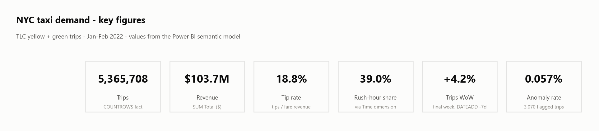

The Jan-Feb 2022 window at a glance, each card a DAX measure: **5,365,708
trips** generating **$103.7M** total revenue, an **18.8%** tip rate, **39.0%**
of trips inside rush-hour windows, and a final week up **+4.2%
week-over-week** (`DATEADD -7d`). Only **0.057%** of trips are flagged
anomalous, so the cleaned data is in good shape.

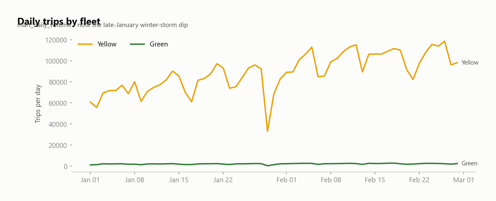

Yellow runs at roughly 40× green's volume, and both grind steadily upward from
~60k trips/day on Jan 1 to ~110k by late February, a clear recovery trend.
The collapse to ~33k on Jan 29 is the 2022 nor'easter blizzard: a one-day
exogenous shock that's obvious in the trend and useful context when judging
the forecast.

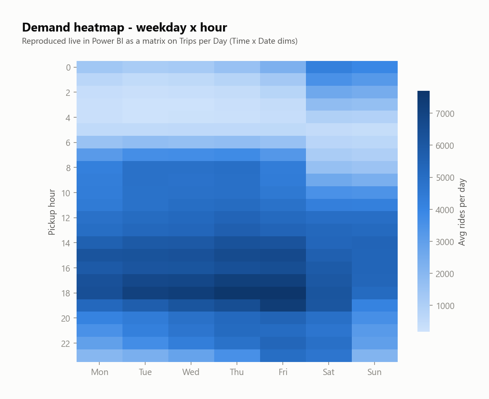

Average rides per weekday × hour, computed live in Power BI as a matrix over
the 5.4M-row fact (Time × Date dimensions). Two distinct regimes: weekdays
build from 6 AM into a dominant 17-19h evening rush (7,000+ rides/h at the
peak), while weekends flip: quiet mornings but far busier 0-3 AM overnight
hours. This double seasonality (daily + weekly) is exactly why the forecast
uses both Fourier terms.

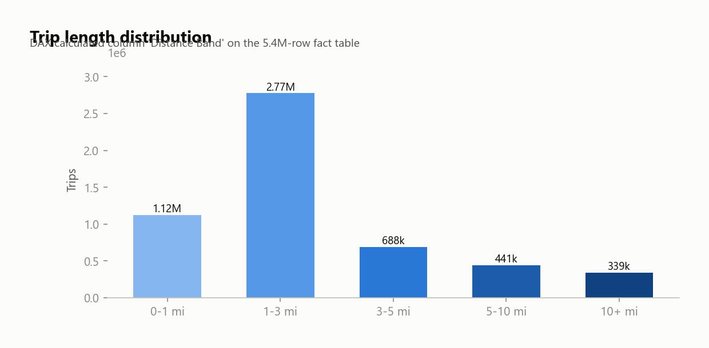

The `Distance Band` DAX calculated column, evaluated over all 5.4M rows:
**2.77M trips (~52%) are 1-3 mi**, and nearly three quarters are under 3 mi;
the taxi is a short-hop mode. The 10+ mi tail (339k trips) is largely airport
traffic, which page 2 makes explicit.

### Page 2: Zone Demand

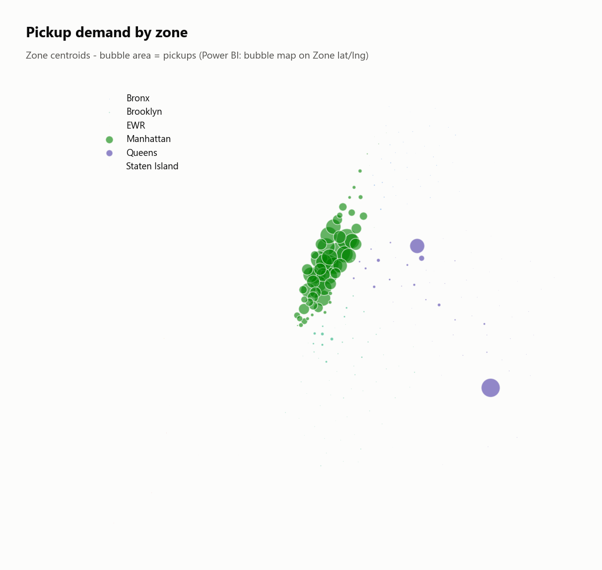

Pickups by zone centroid (lat/lng geo-categorized in the model, bubble area =
pickups). Demand is extremely concentrated: a dense green wall down Manhattan,
plus two large purple Queens bubbles: JFK and LaGuardia. The rest of the city
barely registers at this scale.

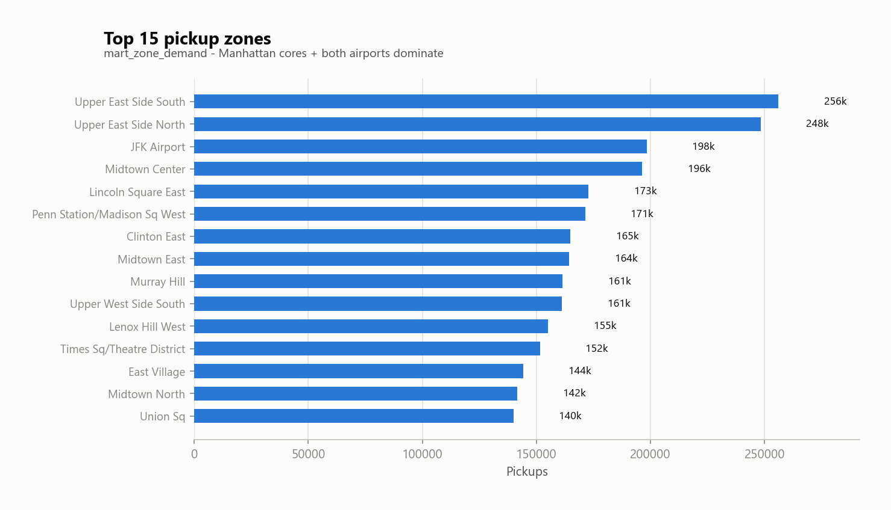

The Upper East Side pair leads (256k + 248k pickups), with JFK (198k) and
Midtown Center (196k) just behind; every top-15 zone is a Manhattan core
except the airports.

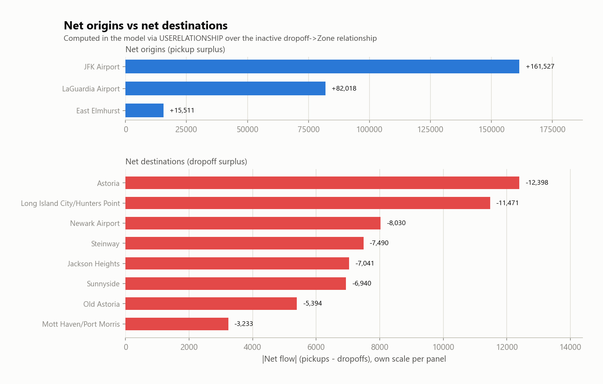

The `USERELATIONSHIP` showcase: `Pickups` uses the active pickup→Zone
relationship, `Dropoffs` switches to the inactive dropoff path, and `Net Flow`
is the difference. Airports *export* riders (**JFK +161,527**, LaGuardia
+82,018) while residential Queens absorbs them (Astoria -12,398, Long Island
City -11,471). Airport imbalances are an order of magnitude larger than any
neighbourhood's.

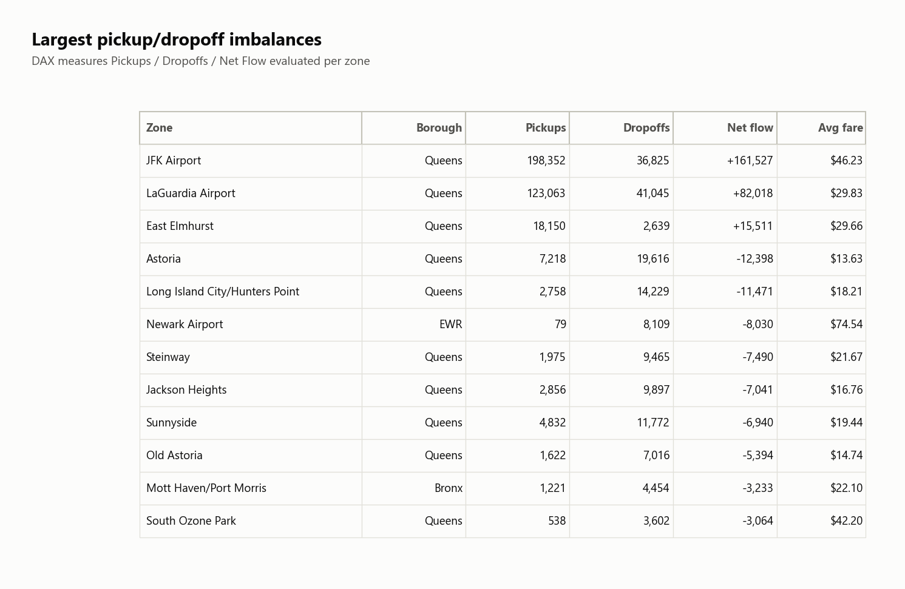

The same measures as a table, with average fare. Two stories hide in it: JFK
sees 198k pickups but only 37k dropoffs (people cab *into* town and return by
other means), and Newark shows just **79 pickups against 8,109 dropoffs** at a
$74.54 average fare: NYC medallion cabs may drop off in New Jersey but can't
pick up there.

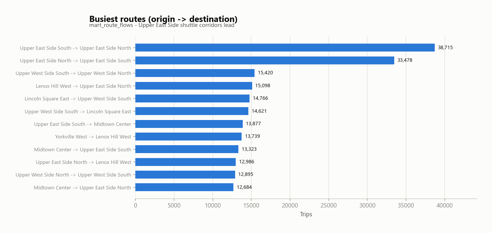

Top origin→destination pairs from `mart_route_flows`: the Upper East Side
South ↔ North shuttle dominates (38.7k + 33.5k trips), and every top route is
a short hop between adjacent Manhattan zones, consistent with the 1-3 mi
distance peak.

### Page 3: Forecast

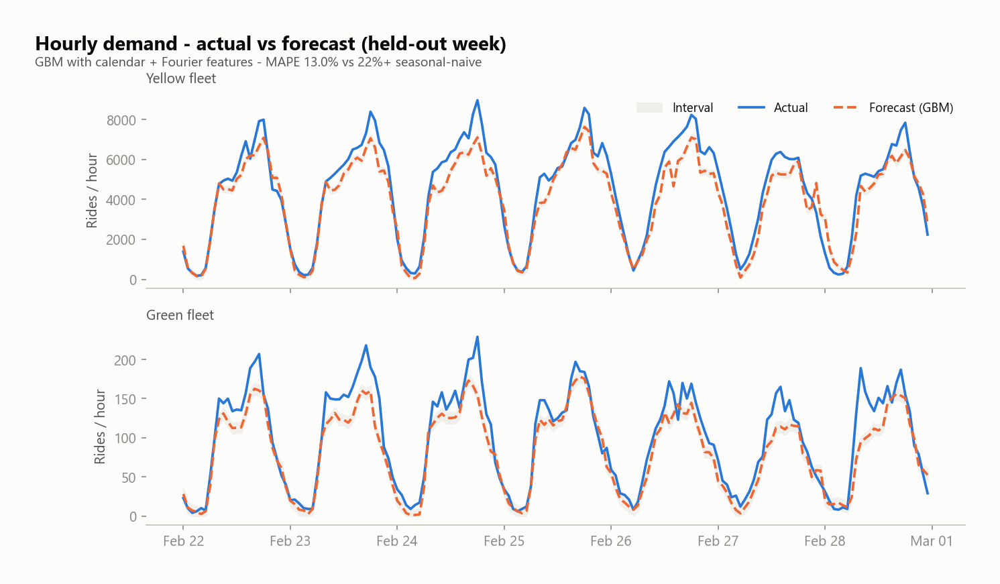

Hourly actual vs GBM forecast (with interval) for the held-out final week,
per fleet. The model tracks the daily double-peak shape and the weekly rhythm
on both fleets; its misses concentrate at sharp evening peaks, which it
under-forecasts (bias -256 rides/h), a conservative failure mode. Overall
**MAPE 13.0%** vs 22%+ for the seasonal-naive baseline.

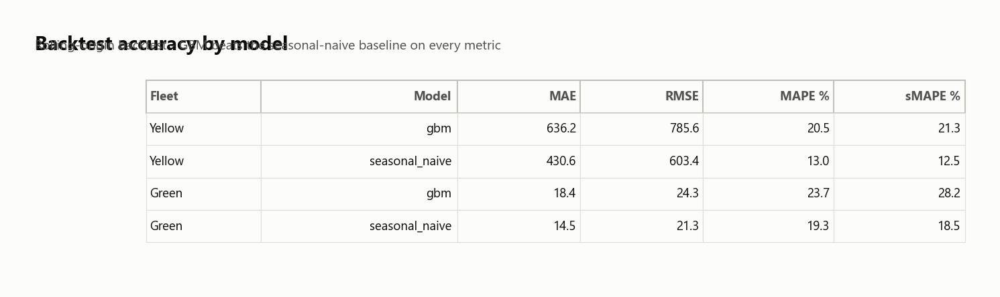

The rolling-origin backtest behind the model choice: MAE / RMSE / MAPE / sMAPE
for every fleet × model combination, straight from `mart_forecast_metrics`:
the evidence table a reviewer would ask for before trusting the chart above.

### Page 4: Data Quality & Anomalies

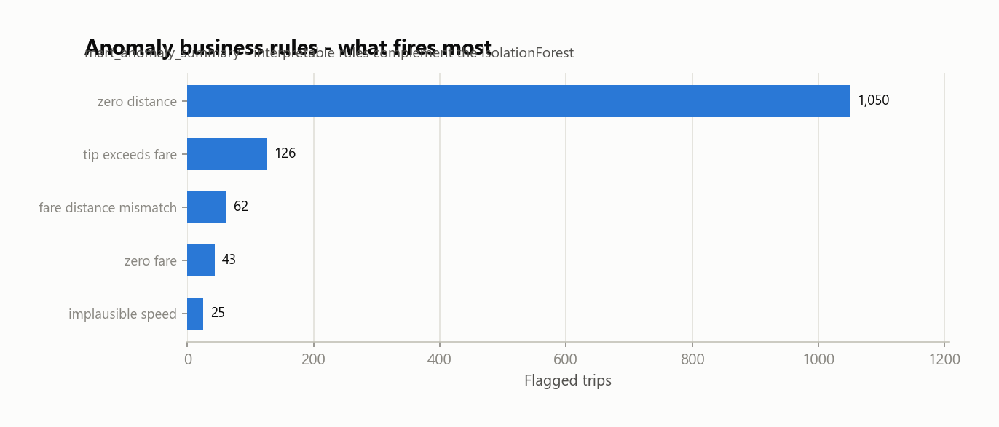

What actually fires: `zero_distance` dominates (1,050 trips), followed by tips
exceeding the fare (126), fare/distance mismatches (62), zero fares (43) and
implausible speeds (25). Interpretable rules complement the IsolationForest
and point at concrete causes (meter faults and data-entry errors) rather
than opaque outlier scores.

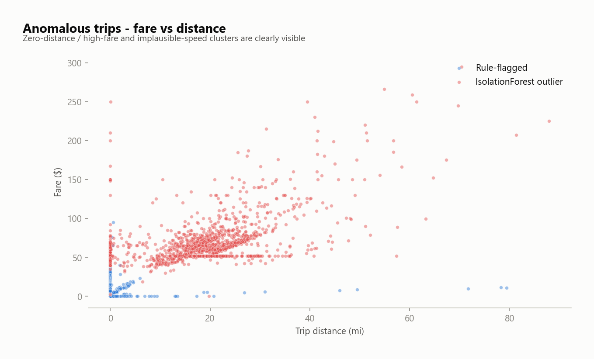

Flagged trips on fare-vs-distance axes. The clusters match the rules: a
vertical zero-distance line of rule-flagged trips at x = 0, a near-zero-fare
band along the bottom, and the IsolationForest cloud of improbable
fare/distance combinations, including a horizontal streak at the ~$52 JFK
flat fare stretching across wildly different distances.

## Data quality

`taxiflow quality` validates a sample against a pandera contract derived from the
cleaning config and computes full-table metrics (row counts, null rates, ranges,
duplicate groups, freshness). Reports are written to `reports/data_quality/`.

## Tests

```bash
pytest          # runs entirely on synthetic data, no network
ruff check src
```

## Layout

```
config/              settings.yaml
sql/marts/           mart SQL (one file per mart)
src/taxiflow/        ingest · staging · quality · warehouse · analytics · viz · bi
tests/               pytest (synthetic fixtures)
dashboard_previews/  rendered Power BI report visuals
data/ exports/ reports/   generated artifacts (gitignored)
```
